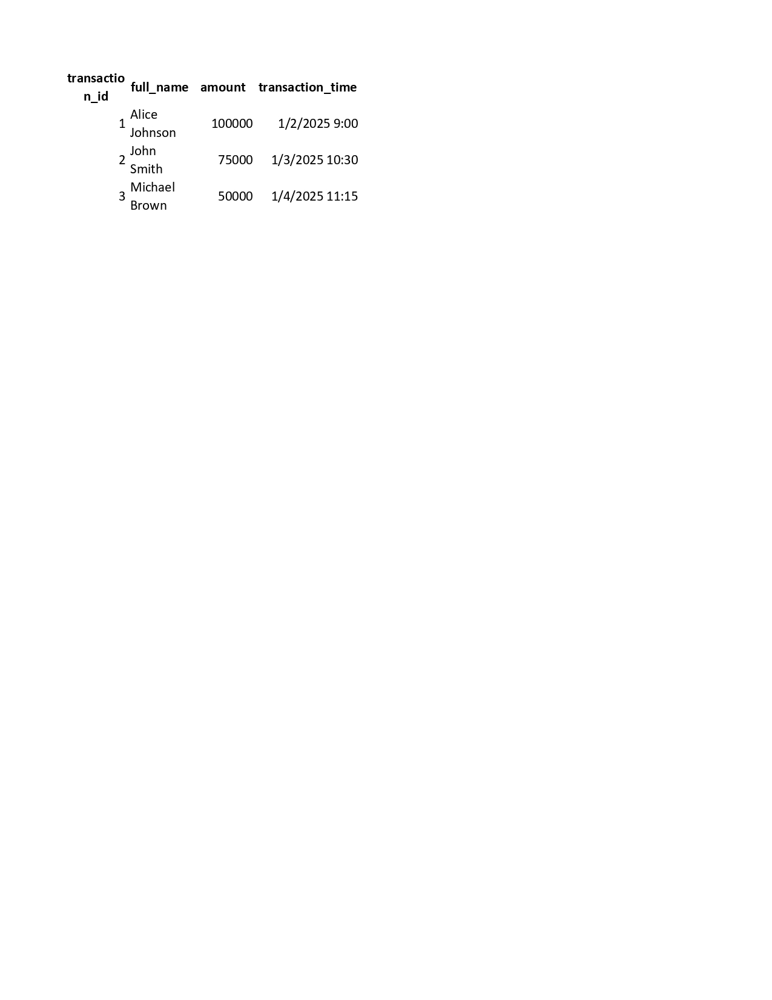
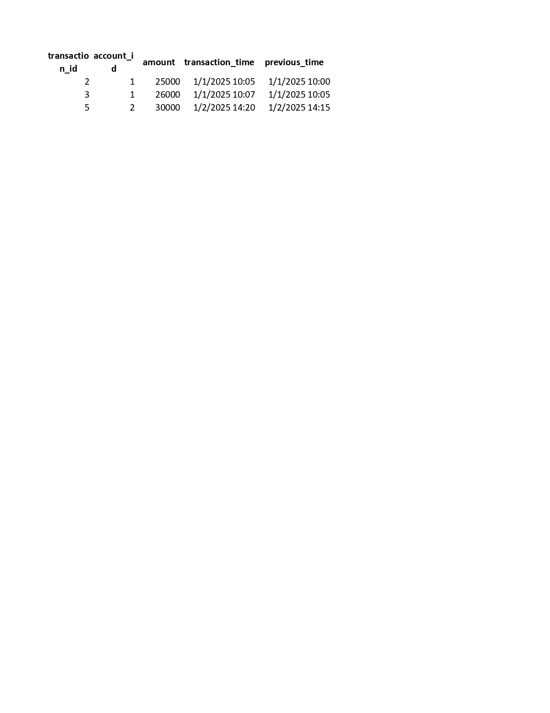
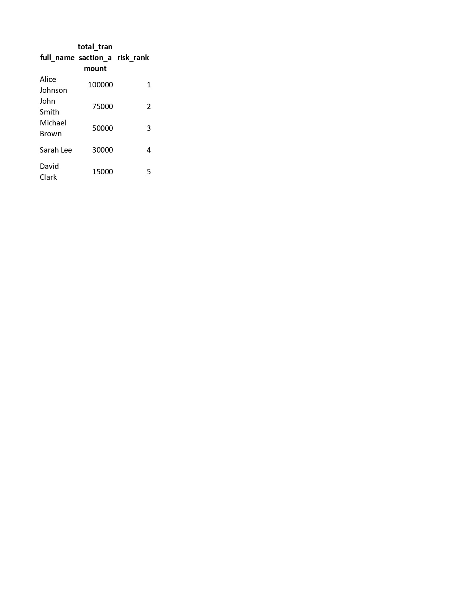

# banking-fraud-detection-sql

SQL project for banking fraud detection using CTE and window functions.

This project demonstrates SQL queries used for detecting potential banking fraud in banking transactions. It includes:

- Database schema (`schema.sql`)  
- Sample data (`sample_data.sql`)  
- Fraud detection queries using CTEs and window functions (`fraud_queries.sql`)  
- Performance indexes to optimize query performance (`indexes.sql`)  
- Example outputs as screenshots

---

### How to Use

1. Open **SQL Server Management Studio (SSMS)**  
2. Create a new database  
3. Run `schema.sql` to create the tables  
4. Run `sample_data.sql` to insert example data  
5. Run `fraud_queries.sql` to see fraud detection results  
6. Optionally, run `indexes.sql` to improve performance of the queries

---

### Sample Output

  
*Example of large transactions detected by the queries.*

  
*Example of rapid transactions detected in a short time frame.*

  
*Example of risk ranking assigned to accounts based on suspicious activity.*

---

### Notes

- This project is designed for learning SQL, CTEs, window functions, and basic fraud detection logic.  
- Screenshots are included to demonstrate sample outputs without needing to run the queries.  
- All SQL scripts are included so you can run them in SSMS or any SQL Server environment.

---

### Author

**Priyanka Murthy**  
GitHub: [PriyankaMurthy24](https://github.com/PriyankaMurthy24)
